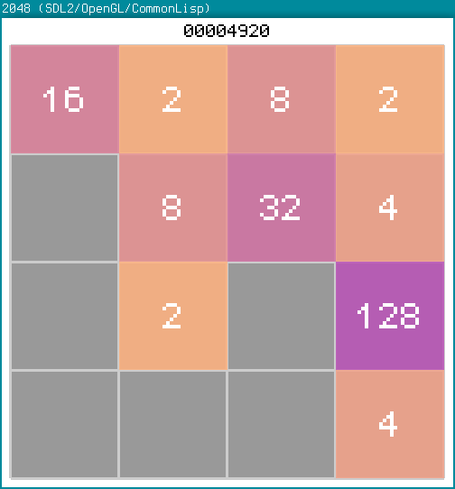

opengames
=========

Pequenos jogos de exemplo com código aberto.

cl-2048
-------

Clone de 2048 em Common Lisp.

Usa SDL2/OpenGL via Quicklisp.
Otimizado para Emacs + SLIME com SBCL.

A fazer:
- Telas rápidas de Win/Lose com score

cl-snake
--------

Mais um clone de Snake, porém feito em Common Lisp.

Usa SDL2 e OpenGL via Quicklisp.
Otimizado para Emacs + SLIME com SBCL.

A fazer:
- Corrigir bug de spawn da fruta
- Adicionar menus
- Adicionar tela de debriefing ao morrer

Para uma versão executável, veja [a página do jogo no itch.io](https://luksamuk.itch.io/cl-snake).

CGOL
-----

Versão própria do Jogo da Vida de Conway.
Escrito em C++, utiliza OpenGL/GLUT.

Atualmente concluído:
- Implementação da grade e das regras do jogo;
- Implementação do redimensionamento da tela;
- Atalhos de teclado;
- Formas comuns para geração através de menu com clique direito;
- Menu de clique direito, conciso e organizado;
- Inserção e seleção de células com botões esquerdo e médio do mouse, respectivamente.

A fazer:
- Mais formas comuns, especialmente formas de crescimento indefinido;
- Encontrar uma forma de sair do jogo de forma segura.

dagarden
-----------

Clone do modo D.A. Garden, do jogo Sonic CD, em C++ e Common Lisp,
utilizando SDL2, SDL2\_Image e OpenGL.

Versão em C++ usa também OficinaFramework 1.3, OpenAL, Ogg, Vorbis, Vorbisfile e PhysicsFS.

Ainda em fase de testes e incompleto.

A fazer:
- Sprites e objetos variados passando pela tela
- Música de fundo
- Menu com alguma coisa?

NOTA: Também inclusa nesta pasta está uma versão 100% em Scheme (dagarden.scm),
compatível com Chicken Scheme, porém inacabada; o suporte a texturas não
parece funcionar bem nos bindings de OpenGL para Scheme.

CBreakout
---------
Clone de Breakout feito em OpenGL/GLUT.
Ainda injogável. Não sei se o continuarei, já fiz um clone
melhor usando Processing, até então.
Status atual:
- Melhorar sistema de FPS;
- Inserir objetos quebráveis;
- Inserir sons simples.

Reversi
-------

Clone de Reversi feito em C e OpenGL.
Status atual:
- Inserir regras do jogo;
- Inserir sistema de contagem de pontos e saída.

CPlatformer
-----------

Platformer rápido feito em C, SDL 1.2 e OpenGL/GLUT.
