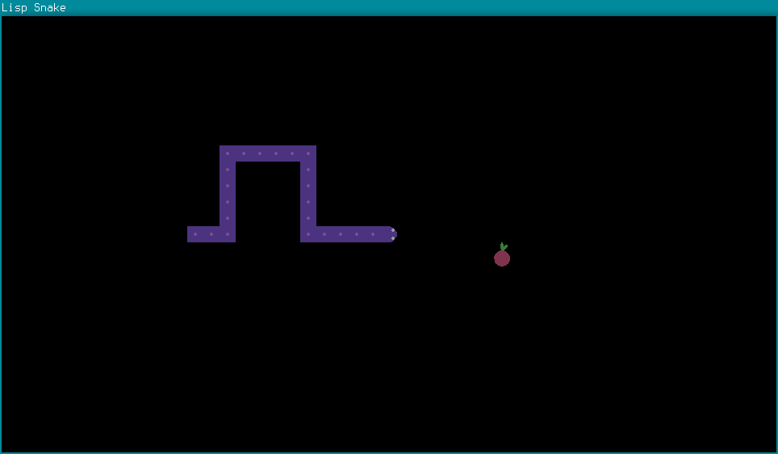
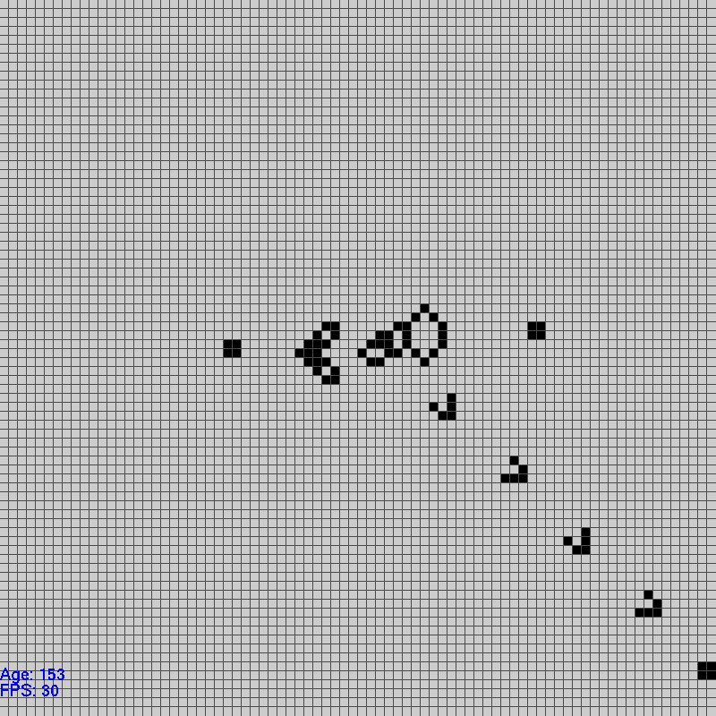
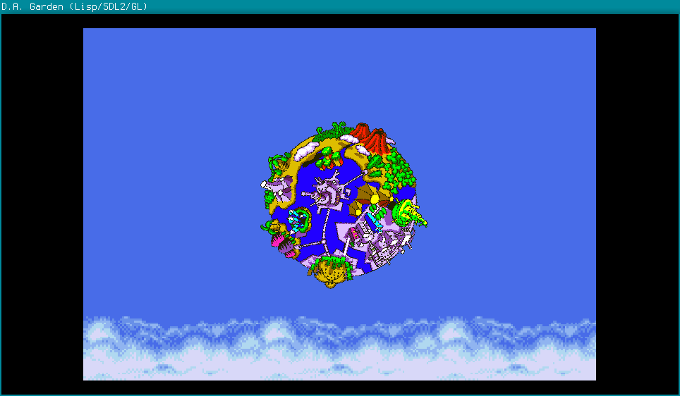
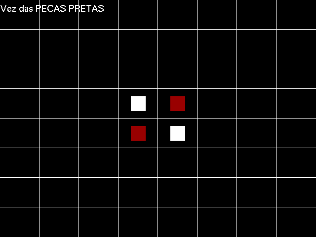
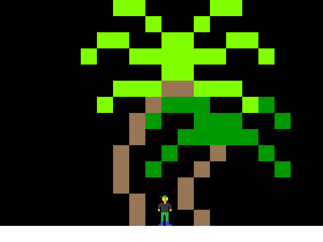
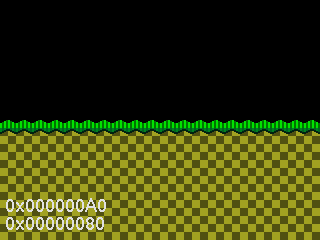

opengames
=========

Pequenos jogos de exemplo com código aberto.

cl-snake
--------

Mais um clone de Snake, porém feito em Common Lisp.

Usa SDL2 e OpenGL via Quicklisp.
Otimizado para Emacs + SLIME.

A fazer:
- Corrigir bug de spawn da fruta
- Adicionar menus
- Adicionar tela de debriefing ao morrer

CGOL
-----

Versão própria do Jogo da Vida de Conway.
Escrito em C++, utiliza OpenGL/GLUT.

Atualmente concluído:
- Implementação da grade e das regras do jogo;
- Implementação do redimensionamento da tela;
- Atalhos de teclado;
- Formas comuns para geração através de menu com clique direito;
- Menu de clique direito, conciso e organizado;
- Inserção e seleção de células com botões esquerdo e médio do mouse, respectivamente.

A fazer:
- Mais formas comuns, especialmente formas de crescimento indefinido;
- Encontrar uma forma de sair do jogo de forma segura.

cl-dagarden
-----------

Clone do modo D.A. Garden, do jogo Sonic CD.
Ainda em fase de testes e incompleto.

A fazer:
- Sprites e objetos variados passando pela tela
- Música de fundo
- Menu com alguma coisa?

NOTA: Também inclusa nesta pasta está uma versão 100% em Scheme (dagarden.scm),
compatível com Chicken Scheme, porém inacabada; o suporte a texturas não
parece funcionar bem nos bindings de OpenGL para Scheme.

CBreakout
---------
Clone de Breakout feito em OpenGL/GLUT.
Ainda injogável. Não sei se o continuarei, já fiz um clone
melhor usando Processing, até então.
Status atual:
- Melhorar sistema de FPS;
- Inserir objetos quebráveis;
- Inserir sons simples.

Reversi
-------

Clone de Reversi feito em C e OpenGL.
Status atual:
- Inserir regras do jogo;
- Inserir sistema de contagem de pontos e saída.

CPlatformer
-----------

Platformer rápido feito em C, SDL 1.2 e OpenGL/GLUT.

CSonic
------

Engine de platformer baseada no Mega Drive/Genesis.
Feito em C, utiliza SDL, OpenGL e GLUT.

Atualmente incluído:
- Sistema completo de paletas de cores em bitmask;
- Funções devidas de manipulação de paletas;
- Função para seleção de cor a partir da paleta, similar ao OpenGL;
- Sistema de renderização de fases dentro de um certo limite, para evitar sobrecarga;
- Tiles de teste feitos a partir de código.
- Suporte a resoluções 1x, 2x, 3x, 4x, 720p, 1080p - fullscreen e windowed;
- Suporte a 25, 20, 30 e 60 FPS;
- Câmera 2D para cada level;
- Suporte total à cor transparente.

A fazer:
- Substituir bloco zero como bloco comum, e completamente transparente por default. Rever esta decisão, porém, pois se o bloco zero for tratado de forma especial, a renderização será um pouco otimizada.
- Armazenar modo da paleta na representação da cor;
- Função para resgatar modo da paleta na representação da cor;
- Colisão para cada piece;
- Implementar motion blur;
- Escrever programa de criação e edição de fases;
- Terminar funções de carregar/exportar paletas e fases;
- Inserir personagens, inimigos, itens e etc que podem ser configurados através de script.

CHngmn
------

Versão própria de um jogo de forca, escrito em C++.

A fazer:
- ...tudo.

dsnakeb
-------

Clone do jogo Snake para celulares (versão básica sem labirintos).

A fazer:
- Sistema de strings (copiar parcialmente da OficinaFramework);
- Sistema básico de telas;
- HUD básico;
- Classes da serpente e da comida;
- Níveis de jogo;
- Mais detalhes a adicionar.

